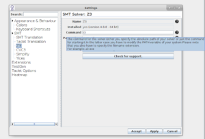

During the VerifyThis competition 2021, KeY was invited to present itself as a Java verification tool.

It is customary for Verify This that for one tool after a brief introduction into the concepts of the tool, the participants are invited to solve a micro challenge – with a little help from present KeY developers.

This years micro challenge is about a line wrapping algorithm!

- [Download KeY](https://www.key-project.org/download/)
- [Presentation slides](slides.pdf)
- Wraplines micro challenge - [Challenge File](WrapUtils.java)
- Wraplines micro challenges - [Solution File](WrapUtilsSolution.java)

The challenge was inspired by a GUI bug in KeY where tooltips suffered
from very long lines. A routine to wrap these tooltips has been
written. But is it correct? Well, let us prove it with KeY! So ...
there is the first part of KeY which has been verified using KeY.
Perhaps not the most important part, but it is a start ...
